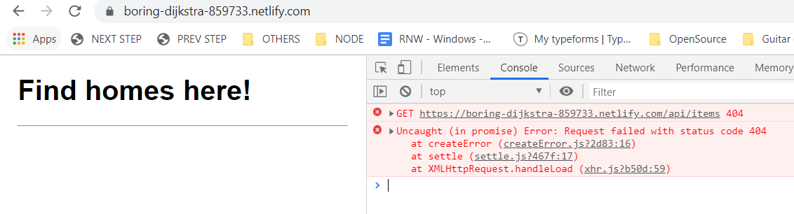

  + `/api/items` not accessible from Netlify 

  + https://www.netlify.com/blog/2018/09/13/how-to-run-express.js-apps-with-netlify-functions/



* Netlify allows deploy of static sites, but cannot host express app

-> allows to run backend code alongside the static site in Netlify
without an external hosting service

-> Lambda functions - code that runs for a specific request, 
pay-per-request, auto scaled by AWS

Lambda functions are very similar to bare-bones http handling in Node (think `http.createServer` and `res.writeHead` )

To simplify writing functions from express app, use `serverless-http` 
which abstracts Lambda functions as a *decorator* in express.

https://functions-playground.netlify.com/

## Examples:

### In plain Lambda function

``` javascript
exports.handler = function(event, context, callback) {
    callback(null, {
        statusCode: 200,
        body: "Hello, World"
    })
}
```

### Using `serverless-http` with Express

``` javascript
router.get('/', (req, res) => {
    res.json("Hello, world");
})

app.use('/.netlify/functions/server', router)

module.exports.handler = serverless(app)
```

