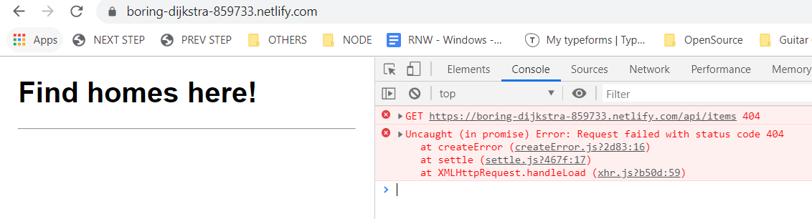

# Homelify

Real estate scraper for around Quebec

## 🚧👷‍ In progress

### 9/8/2019

* Scraper: module functional for one site
  + scraped items go to diskdb database
* API: serve db items in `api/items` 
* Runner: execute when server restarted ( `server.js` ), only once per day using db logs `date_last_run` 
  + but still have to trigger a server restart/deploy to re-run
* UI: basic view

TODO: 

* RUNNER: trigger script through a scheduler, instead of server start
* UI: continue work on items view
* DEPLOY: make API work through Netlify functions
  + `/api/items` not accessible from Netlify 
  + https://www.netlify.com/blog/2018/09/13/how-to-run-express.js-apps-with-netlify-functions/

