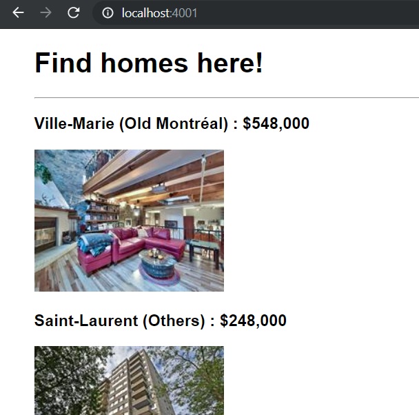
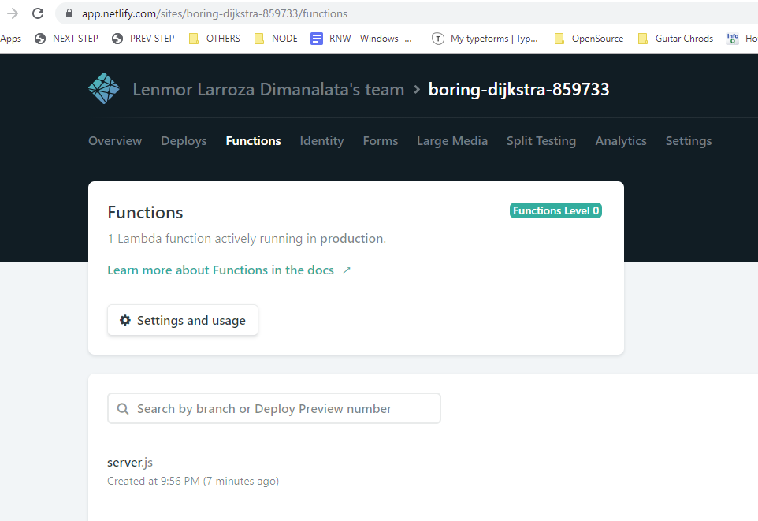

# Homelify

Real estate scraper for around Quebec

## 🚧👷‍ In progress

### 9/8/2019

* Scraper: module functional for one site
  + scraped items go to diskdb database
* API: serve db items in `api/items` 
* Runner: execute when server restarted ( `server.js` ), only once per day using db logs `date_last_run` 
  + but still have to trigger a server restart/deploy to re-run
* UI: basic view

TODO: 

* RUNNER: trigger script through a scheduler, instead of server start 
* UI: continue work on items view
* ➖ DEPLOY: make API work through Netlify functions

   ✅ Lambda functions deployed

      Test in local: http://localhost:4000/.netlify/functions/server/
    
      Test in prod:
      https://boring-dijkstra-859733.netlify.com/.netlify/functions/server
    
      See `/lambda/server.js` for all routes (Lambda functions)
    
      Shows up here:
    

   [ ] Still need to connect a DB, to serve data

