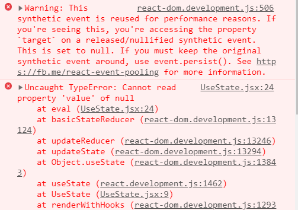

## what are hooks?

* allows functional/stateless components to "hook" into state, side-effects
* `useState` replaces `setState` 
* `useEffect` replaces `componentDidMount, componentWillMount, componentWillUnmount` 
* can create your wn hooks

## why hooks?

* can replace HOC and render prop to share logic between components

https://blog.logrocket.com/a-guide-to-usestate-in-react-ecb9952e406c/
https://www.valentinog.com/blog/hooks/

## ⚠ Careful with events and nested functions when using hooks

This doesn't work!

``` 

				<input
					value={user.name}
					onChange={event => 
						setUser(prev => {
							return {
								...prev,
								name: event.target.value
							};
						})
					}
				/>
    
```    

This works

```

				<input
					value={user.name}
					onChange={event => {
						const val = event.target.value;
    
						setUser(prev => {
							debugger;
							return {
								...prev,
								name: event.target.value
							};
						});
					}}
				/>
    
    
    
    
    
    

```

    
    
    
    
    
    
    
    
    



1st call its the event
2nd call its the synthetic event

😱

# Rules
Each hook is stored in a list, and there’s a variable that keeps track of the currently executed hook.

Only call hooks at the top level
Not inside conditions/loops/nested functions, 
React relies on the order in which useState functions are called to get the correct value for a particular state variable.

